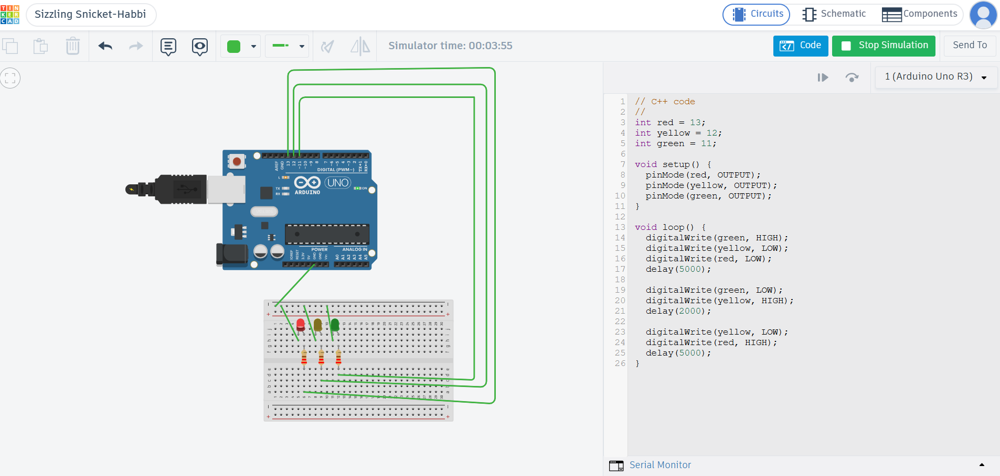

# Traffic-Light-System-using-Arduino

## Description
A simple Arduino-based traffic light system that controls red, yellow, and green LEDs in sequence using predefined time delays.

## Components

- Arduino Uno
- Red LED
- Yellow LED
- Green LED
- 3 × 220Ω Resistors
- Breadboard
- Jumper Wires

- ## Working

The Arduino controls three LEDs connected to digital pins 13, 12, and 11. The green LED stays ON for 5 seconds, the yellow LED for 2 seconds, and the red LED for 5 seconds. This sequence repeats continuously.

## Project Image

## Programming

Arduino C/C++

int red = 13;

int yellow = 12;

int green = 11;

void setup() 

{
  pinMode(red, OUTPUT);
  
  pinMode(yellow, OUTPUT);
  
  pinMode(green, OUTPUT);
}

void loop() 

{
  digitalWrite(green, HIGH);
  
  digitalWrite(yellow, LOW);
  
  digitalWrite(red, LOW);
  
  delay(5000);

  digitalWrite(green, LOW);
  
  digitalWrite(yellow, HIGH);
  
  delay(2000);

  digitalWrite(yellow, LOW);
  
  digitalWrite(red, HIGH);
  
  delay(5000);
}

